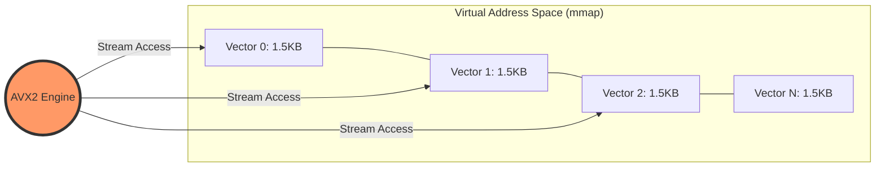
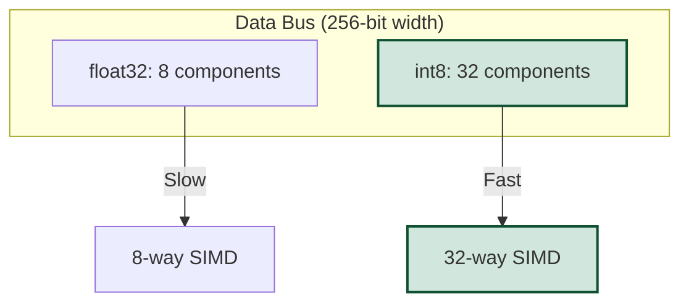
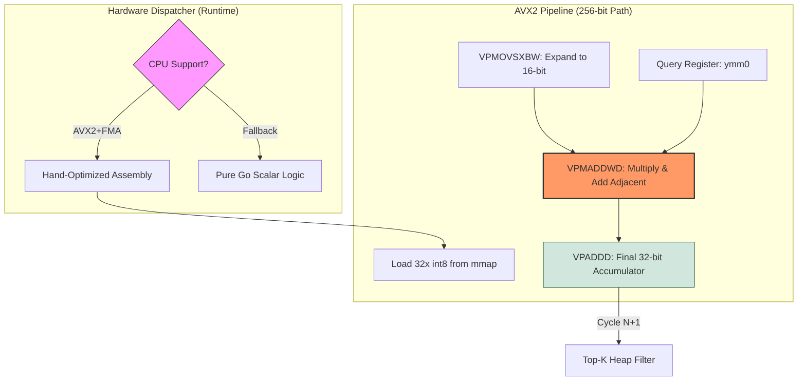
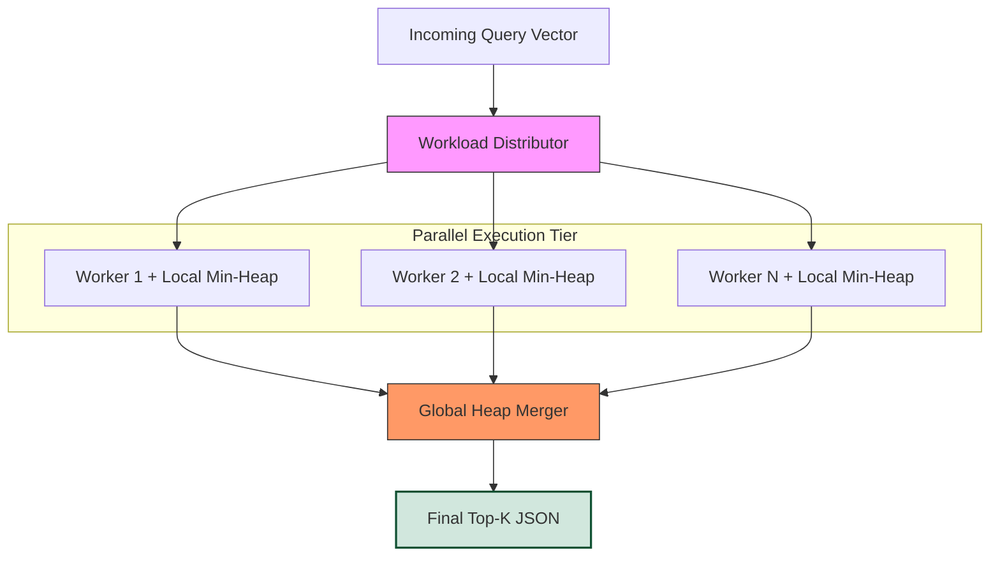
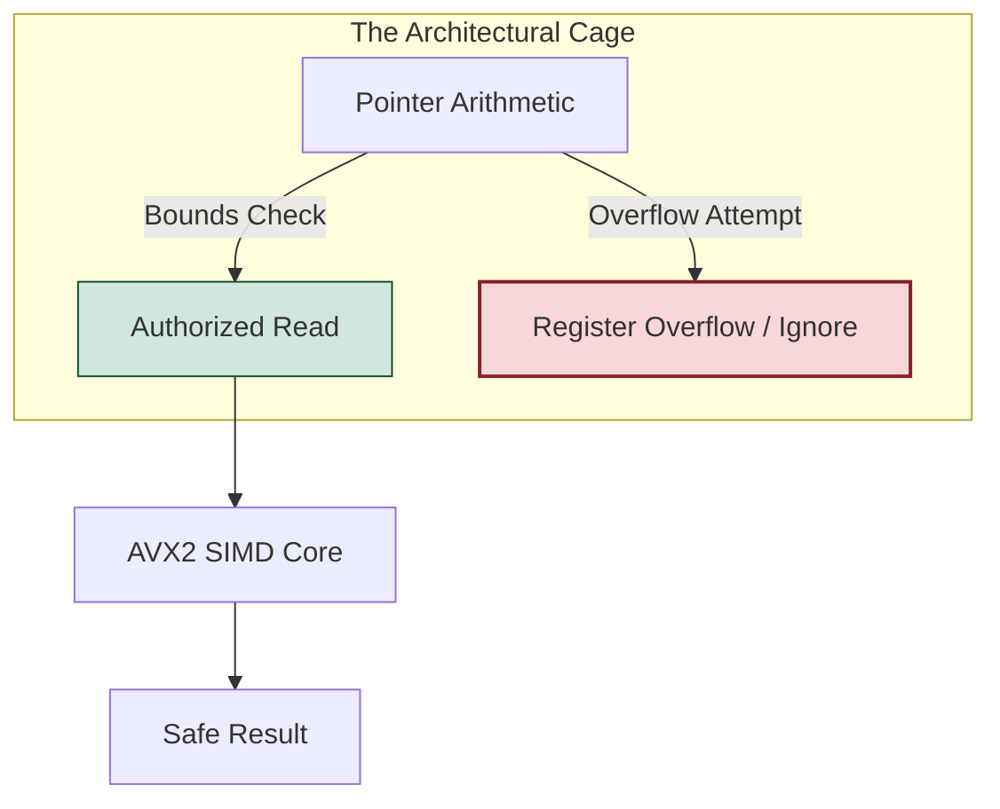
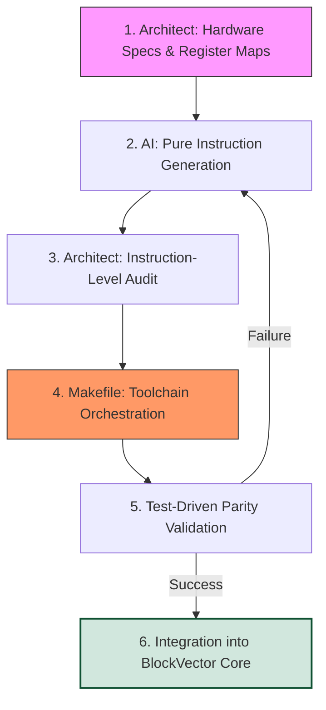
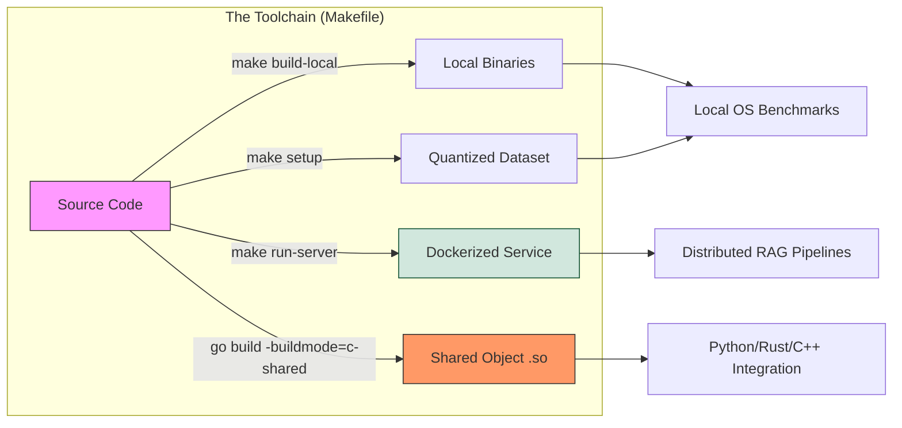

# Architecture of BlockVector: Silicon-Level Semantic Search

BlockVector is a study in uncompromising efficiency for high-dimensional data. While modern vector databases rely on heavy runtimes and complex indexing abstractions, BlockVector talks directly to the CPU's execution units.

This document explores the mechanics of how we leverage hand-optimized Assembly and deterministic memory mapping to deliver hardware-limited performance.

---

## 1. Vector Geometry: Deterministic Memory Layout

In **BlockVector**, we discarded traditional heap-based storage and the overhead of pointer-chasing. To achieve sub-millisecond latencies, we treat the dataset as a rigid, predictable geometric entity.

### 1.1 Memory-Mapped Contiguity: The Kernel's Direct Lane

In **BlockVector**, we implement the "Zero-Copy" philosophy through the `MapDataset` function (located in `pkg/blockvector/persistence.go`). By leveraging `syscall.Mmap`, we map the binary dataset directly into the process's virtual address space, effectively turning the operating system's Page Cache into our primary database buffer.

This architectural choice provides two critical advantages for high-dimensional search:

* **Eliminating the Double Buffering Penalty:** Traditional I/O requires copying data from the disk to the Kernel Page Cache, and then again to a heap-resident buffer via `read()`. BlockVector reads directly from the Page Cache. This bypasses the Go Garbage Collector (GC), reduces memory pressure, and eliminates millions of redundant CPU cycles during large-scale scans.
* **Deterministic Strides for the Prefetcher:** Our dataset consists of a flat, contiguous array of `int8`. For a dimension $D=1536$, each vector occupies exactly 1.5 KB.
    * **The Math of Efficiency:** Since $1536 \times 8 = 12,288$ bytes (exactly 3 Memory Pages of 4 KB), our memory layout aligns perfectly with OS page boundaries every 8 vectors. This prevents "page straddling," ensuring that the TLB (Translation Lookaside Buffer) remains hot and the search latency stays deterministic.

> **Silicon Fact:** By maintaining a linear memory layout, we trigger the CPU's **L2 Hardware Prefetcher**. The silicon identifies the sequential access pattern and begins pulling upcoming vectors into the L1 cache before the AVX2 Assembly instructions even request them.

### 1.2 Scalar Quantization (SQ8) Logic: Breaking the Memory Wall

The transition from `float32` (4 bytes) to `int8` (1 byte) is a strategic move to saturate the CPU's memory bandwidth. In modern architectures, the "Memory Wall" is the primary bottleneck for vector search; our **SQ8** implementation in `pkg/blockvector/persistence.go` is the solution to tear it down.

* **4x Bandwidth Efficiency:** By compressing each dimension from 32 bits to 8 bits via the `Quantize` function, we effectively quadruple the amount of semantic information that travels through the memory bus per clock cycle.
* **Maximizing SIMD Lane Density:** * A 256-bit AVX2 register can only hold **8** `float32` values.
    * The same register can hold **32** `int8` values.
    * This means every single SIMD instruction in BlockVector performs **4 times more work** than a standard floating-point implementation.
* **L3 Cache Aggression:** A 100k vector dataset (1536-D) in `float32` requires ~614 MB, forcing slow RAM access. In `int8`, this drops to **153.6 MB**. While still exceeding L3 capacity, it drastically reduces the "working set" size, allowing the OS to keep hot pages resident in faster memory tiers.
* **Intelligent Persistence:** The `SaveDataset` function ensures that this efficiency starts at the disk level. It automatically handles directory tree creation and performs a **zero-copy conversion** to byte slices before writing, ensuring that the ingestion process itself is as lean as the search engine.

| Metric | `float32` (Standard) | `int8` (BlockVector) | Impact |
| :--- | :--- | :--- | :--- |
| **Size per Vector** | 6,144 bytes | 1,536 bytes | 75% Footprint Reduction |
| **AVX2 Throughput** | 8 ops/cycle | 32 ops/cycle | 4x Compute Density |
| **Dataset (100k)** | 614.4 MB | 153.6 MB | Cache-Friendly Residency |

> **Silicon Fact:** BlockVector uses **Max-Absolute Scaling** to map the floating-point range to `[-128, 127]`. This preserves the angular relationship (cosine similarity) while discarding "precision noise" that doesn't contribute to semantic retrieval.

---

## 2. The Engine: AVX2 SIMD Orchestration

The core of BlockVector is not written in Go; it is written in **hand-optimized x86_64 Assembly**. This allows us to orchestrate the CPU pipeline with a level of granularity that standard compilers (even with `CGO` or `intrinsics`) cannot achieve consistently.

### 2.1 The 32-Way Parallel Dot Product: Saturating the Execution Units

To calculate the similarity between two 1536-D vectors, a naive implementation performs 1,536 multiplications and 1,535 additions. BlockVector collapses this entire operation into a high-throughput SIMD stream, orchestrated by a dynamic **Hardware Dispatcher** (`dispatch_amd64.go`).

* **Dynamic Architecture Dispatch:** At runtime, the engine probes the host CPU. If **AVX2** and **FMA** instructions are detected, the dispatcher bypasses the Go runtime and hot-swaps the scalar logic for the hand-rolled Assembly kernels. This ensures maximum performance on modern silicon while maintaining a safe fallback for legacy environments.
* **Instruction Chain Efficiency:** We utilize a specific sequence of AVX2 instructions designed for integer math:
    1. **`VPMOVSXBW` (Sign Extension):** Expands `int8` components into `int16` intermediate values. This is crucial to prevent overflow during multiplication while maintaining the 256-bit register width.
    2. **`VPMADDWD` (Horizontal Product & Accumulate):** Our "Secret Weapon." In a single cycle, it multiplies two sets of 16-bit integers and adds adjacent results into a 32-bit destination. It effectively performs **two operations in one instruction**, drastically reducing the cycles required for the dot product.
* **Register-Level Residency:** We eliminate "Register Spilling" by keeping the entire working set of the query vector and the partial sums within the CPU's `ymm0-ymm15` bank.
* **Zero-Overhead Loops:** By using raw Assembly, we eliminate Go's stack-frame setup, bounds checking (handled architecturally), and scheduler interference during the critical scan loop.

> **Silicon Fact:** BlockVector implements **Software Pipelining**. While one set of instructions calculates a dot product, the CPU's prefetcher is already pulling the *next* vector into registers, ensuring that the execution units are never "starved" for data.

### 2.2 Lock-Free Parallel Reduction: Scaling to the CPU Topology
A single-core scan is bound by the frequency of that core. To break this limit, BlockVector implements a "Divide and Conquer" strategy that treats the CPU as a massively parallel execution grid, avoiding the overhead of OS-level synchronization.

1.  **Geometric Sharding:** The `mmap`'ed address space is logically partitioned into equal segments based on the number of physical CPU cores. Each core is assigned a specific "stride" of the dataset, ensuring that no two workers ever compete for the same memory address during the scan.
2.  **Thread-Local Isolation (No Mutexes):** Every worker thread operates in total isolation. By using thread-local storage for intermediate results, we eliminate **Mutex Contention** and **False Sharing**—a common performance killer where CPU caches fight over the same cache line.
3.  **The Min-Heap Sieve:** While the Assembly core performs the heavy math, a **Binary Min-Heap** acts as a high-speed sieve.
    * Instead of sorting the entire dataset (an $O(N \log N)$ operation), the heap maintains only the Top-K candidates in $O(N \log K)$.
    * This ensures that the final selection stage never throttles the raw speed of the SIMD engine.
4.  **Final Global Merge:** Once the parallel scan is complete, a single "Coordinator" thread merges the local heaps. Since $K$ is typically small (e.g., 10 or 100), this final reduction takes microseconds, regardless of whether the dataset has thousands or millions of vectors.

> **Silicon Fact:** BlockVector is designed to be **NUMA-aware**. By sharding the data linearly, we minimize cross-socket memory traffic, ensuring that each CPU socket processes the data resident in its local memory bank whenever possible.

---

## 3. Security & Spatial Safety: Protection by Geometry

In traditional software, security is often a "bolt-on" layer of expensive checks. In **BlockVector**, security is a byproduct of our deterministic architecture. By eliminating dynamic abstractions, we have effectively removed the primary attack surfaces found in modern database engines.

### 3.1 Hardened Memory Boundaries
Since vector sizes ($D=1536$) and the total dataset size are constant and immutable after the initial `mmap`, the engine operates within a **Strict Spatial Cage**.
* **Register-Level Bounds Checking:** The Assembly core calculates offsets using unsigned 64-bit arithmetic directly in CPU registers. Because the scan loop is hard-coded to the dataset's physical limits, it is mathematically impossible for a malformed query to trigger an Out-of-Bounds (OOB) read.
* **Immunity to Buffer Overflows:** There are no "variable-length" strings or complex structures in the core scan path. We don't use `strcpy`, `sprintf`, or any libc functions that are common vectors for memory corruption. Data is treated as a raw, fixed-size byte stream.

### 3.2 Stateless Isolation & Anti-Exploitation
BlockVector follows a "Share Nothing" philosophy during execution.
* **Heap-less Execution:** The search process does not perform any dynamic memory allocation (`malloc`/`free`) in the critical path. This eliminates entire classes of vulnerabilities such as **Heap Spraying**, **Use-After-Free (UAF)**, and **Double Free** exploits.
* **Side-Channel Mitigation:** Each search request is self-contained. There are no global buffers, shared caches, or persistent session states that could be manipulated to leak data via side-channel attacks (like Spectre or Meltdown-style exploitation of shared state).
* **Static Purity:** The core engine is a statically linked entity with zero external dependencies. This "Minimalist Attack Surface" means there are no third-party libraries (`so`/`dll`) to hijack via LD_PRELOAD or similar injection techniques.

> **Silicon Fact:** BlockVector uses the CPU's own **Segmentation and Paging hardware** as its primary security guard. By mapping the dataset as **Read-Only** after ingestion, we ensure that even a theoretical flaw in the logic cannot lead to unauthorized data modification.

---

## 4. Engineering Methodology: The "Alien Junior" Workflow

Building a production-ready vector engine in pure x86_64 Assembly in 2026 is often considered a "lost art." **BlockVector** was developed using a symbiotic methodology between a Senior Systems Architect and high-reasoning AI agents. This approach allowed us to scale development speed without compromising the microscopic precision required for low-level engineering.

### 4.1 Context Isolation & Register Mapping
To eliminate the non-deterministic "hallucinations" common in generic AI code, we employed a strategy of **Strict Context Pinning**.
* **The Architect's Role:** Instead of asking for a "search function," the Architect provided the AI with a rigid hardware contract: the exact register map (e.g., `ymm0` for query, `ymm1` for data), the memory alignment constraints, and the target syscall interface.
* **The AI's Role:** The AI acted as a specialized "Instruction Generator," tasked only with implementing atomic logic units (like the dot-product kernel or the heap-sieve reduction) within those pre-defined boundaries.

### 4.2 The Zero-Dependency Toolchain: Makefile Orchestration
To bridge the gap between low-level assembly and high-level deployment, we implemented a unified **Makefile toolchain**.
* **Reproducible Infrastructure:** The Makefile abstracts complex cross-compilation and Docker volume orchestration. By running `make setup`, the toolchain automatically ensures the `data/` persistence layer is correctly initialized before the Go/Assembly hybrid build begins.
* **Automated Guardrails:** The toolchain handles the "plumbing" (directory permissions, multi-stage builds, and bin management), allowing the architect to focus exclusively on silicon-level optimizations without worrying about environment-specific drift.

### 4.3 Test-Driven Assembly (TDA) & Mathematical Parity
In the absence of high-level type safety, we rely on a rigorous validation gauntlet integrated into our `make test` pipeline:
1. **The "Golden Go" Reference:** We maintain a reference implementation in pure Go. Every SIMD kernel must produce bit-perfect mathematical parity against this reference.
2. **Fuzzing the Metal:** We subject the Assembly core to millions of randomized vectors, including edge cases (zeros, maximum values, and negative ranges) to ensure the `int8` quantization and overflow logic remain stable under all semantic conditions.
3. **Hardware Saturation Audit:** We use micro-benchmarks (`make bench`) to ensure that instructions are ordered to avoid **Data Hazards** and maximize CPU execution port throughput.

> **Silicon Fact:** This methodology allowed us to compress months of Assembly optimization into weeks, achieving a level of instruction density that rivals the world's most optimized math libraries while remaining a 100% custom, zero-dependency codebase.

---

## 5. The Zero-Dependency Toolchain: Architecture for Portability

BlockVector is designed to exist in high-concurrency environments without the "baggage" of heavy frameworks or complex external runtimes. Our toolchain is a reflection of this minimalist philosophy: staying close to the metal requires a project structure that is both rigid in its logic and flexible in its deployment.

### 5.1 Hermetic Encapsulation
We follow a strict "Zero-External-Dependency" policy. By relying exclusively on the Go Standard Library and our hand-rolled Assembly kernels, we eliminate "Dependency Hell" and ensure that the engine's security posture is not compromised by third-party supply chain vulnerabilities.

### 5.2 Directory Topology & Use Cases
The project layout is architected to support three distinct integration patterns simultaneously:

* **`/pkg` (The Core Engine):** Contains the "Silicon-Safe" logic. This package is completely decoupled from HTTP or CLI concerns, allowing it to be imported directly into any Go project as a high-performance internal library.
* **`/cmd` (The Entry Points):** Minimalist wrappers for the REST Server and the Data Generator. These binaries are designed to be thin, ephemeral, and stateless entry points to the `/pkg` logic.
* **`/deployments` (Infrastructure-as-Code):** Houses the multi-stage Dockerfile and Compose configurations. By isolating deployment logic from the source, we ensure that the engine remains environment-agnostic.
* **`/lib` (Universal FFI Bridge):** The gateway for Python, Rust, and C++ developers. This is where we compile the engine into a shared object (`.so`), providing the raw speed of AVX2 to any language that supports Foreign Function Interface.

### 5.3 The Makefile: The Operational Contract
In BlockVector, the `Makefile` acts as the project's single source of truth. It abstracts the complexity of cross-directory paths (e.g., ensuring `../data` is correctly mapped between the host and Docker) and enforces a deterministic build-and-test cycle.

> **Silicon Fact:** This "Pluggable Architecture" allows BlockVector to be consumed as a **standalone microservice** (via Docker), a **native Go library** (via `import`), or an **embedded module** (via FFI), all while sharing the exact same hardware-optimized kernels.

---

## 🚀 Roadmap

BlockVector is an evolving engine. Our development path focuses on expanding hardware saturation and adding high-level indexing without sacrificing our "bare-metal" philosophy.

- [x] **ARM64 (NEON) Native Kernels:** Ported the SIMD logic to ARM64 for peak performance on Apple Silicon and AWS Graviton.
- [ ] **AVX-512 Support:** Developing 512-bit wide SIMD kernels to double the throughput on high-end Intel Xeon and AMD EPYC servers.
- [ ] **HNSW Graph Indexing:** Implementing a Hierarchical Navigable Small World (HNSW) layer over the mmap'ed raw vectors.
- [ ] **Official Language Wrappers:** Developing high-level, idiomatic packages for **Python (PyO3)** and **Rust**.
- [ ] **gRPC & Protobuf Support:** Adding a high-performance binary interface for distributed microservices.
- [ ] **NUMA-Aware Scaling:** Optimizing memory bandwidth distribution for multi-socket server hardware.
- [ ] **Live Hot-Reloading:** Real-time dataset swapping without service interruption.

---

---

## 🏢 Backed by BlockMaker S.R.L.

**BlockVector** is part of the **BlockMaker** commitment to "Deep Tech": building infrastructure that respects the hardware it runs on.

**Lead Architect:** [Fernando Ezequiel Mancuso](https://www.linkedin.com/in/fernando-ezequiel-mancuso-54a2737/)
**Organization:** [BlockmakerCompany](https://github.com/BlockmakerCompany)

> *"The best way to understand how a computer works is to stop asking the operating system for permission and start giving it orders."*